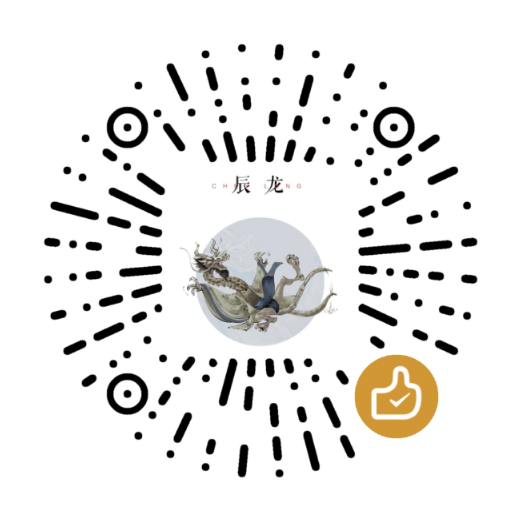

# 关于

> 一个永久免费的编程入门小工具

哈喽，谢谢你点开【关于】。

这个代码地牢小程序是我自己做的，永久免费，所有 49 关全部开放，没有任何收费项目，也不会弹出广告。

我当初做它的原因：很多人想入门编程，但一上来就被复杂的软件、难懂的术语劝退。所以我做了这个小游戏式的练习工具，一关一关带你上手。从最简单的移动指令开始，慢慢学习循环、if 判断，一边闯关一边理解代码到底在干什么。

闯关的时候卡关很正常，写代码本来就是不断试错。多试几次，观察英雄的动作，找到逻辑漏洞，就是学习的过程。

如果你喜欢这个小程序，欢迎分享给朋友。有任何 bug 或者改进想法，也欢迎反馈给我。

希望你玩得开心，在闯关的过程里，感受到编程的乐趣。

## 开发者

- 作者：alucardulad
- 邮箱：[alucardulad@gmail.com](mailto:alucardulad@gmail.com)
- 反馈：欢迎提 issue，或者直接发邮件告诉我

## 打赏码

如果这个小工具帮到了你，可以扫码请我喝杯咖啡 ☕

（原海报保存在 `docs/images/donate-qr.png`；上面这张是它的裁剪版，去掉了四周空白，扫码更清楚。）

---

本页与游戏内【关于】页面同源，由 `npm run about:md` 从 `assets/scripts/ui/about.ts` 生成，请勿手改。
