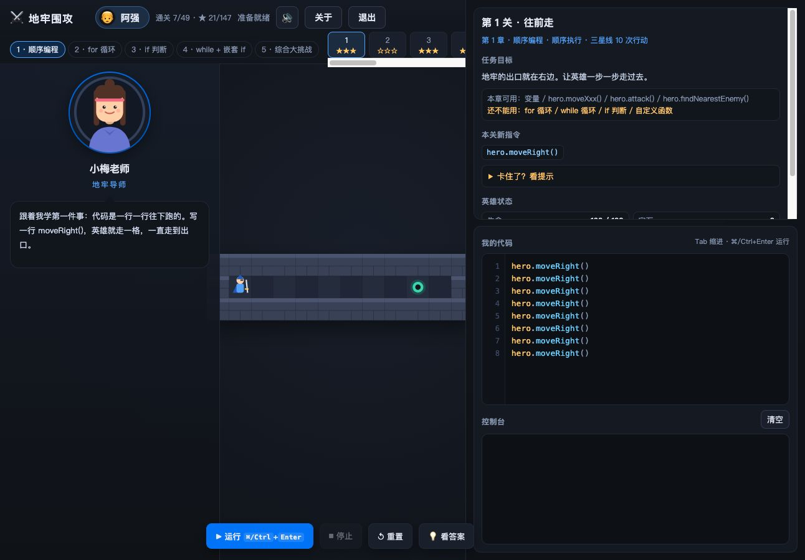
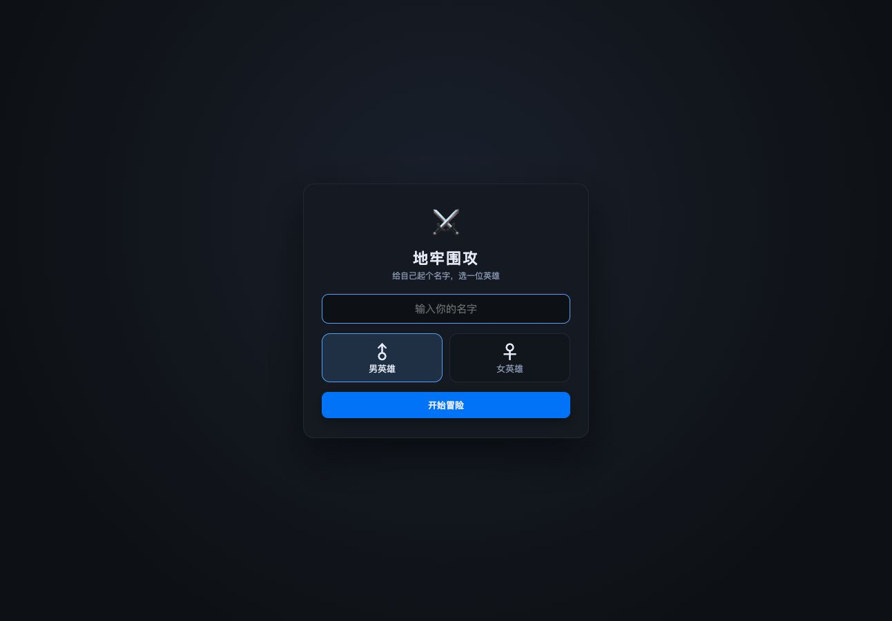
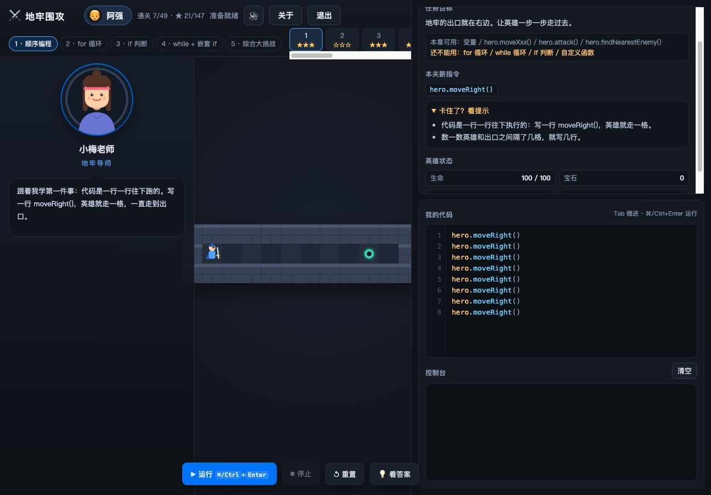
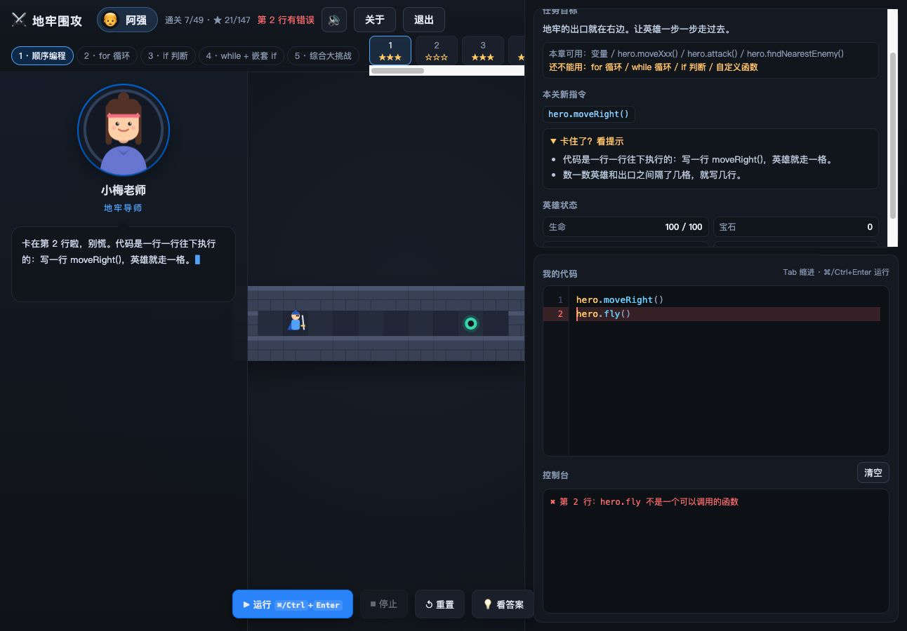
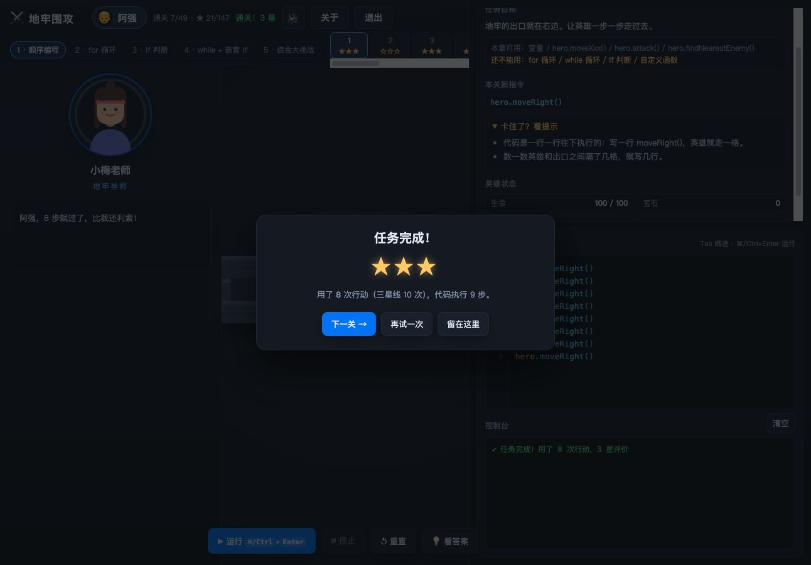
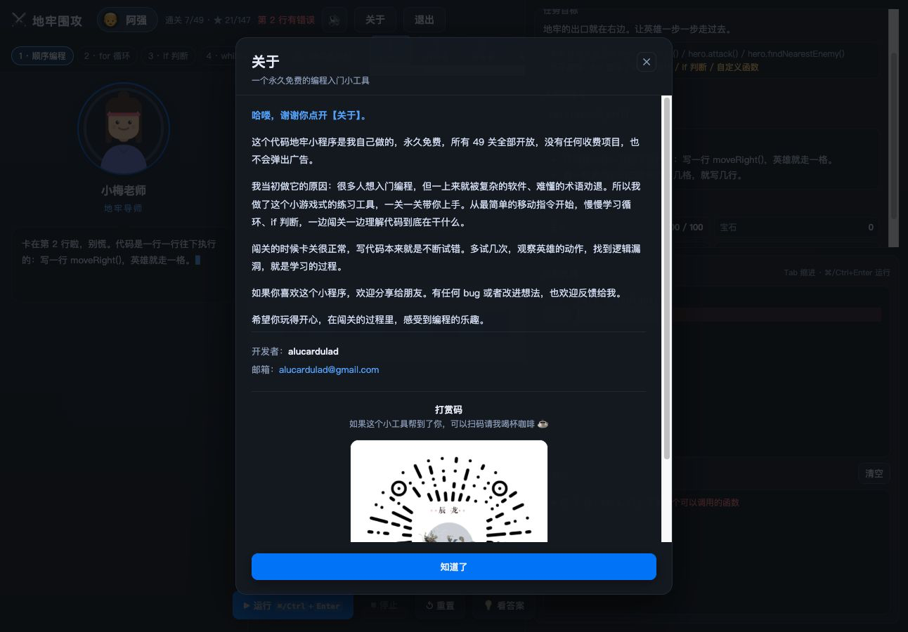

# ⚔️ 地牢围攻（CodeDungeon）

> 写几行代码，英雄就替你闯地牢。

《地牢围攻》是一个 CodeCombat 风格的编程入门小游戏：你在右侧写 JavaScript，英雄就在地牢里走路、砍怪、捡宝石、绕开尖刺。不用装复杂软件，不懂术语也能上手——代码写错了会有中文报错，卡住了有导师手把手教。

**永久免费 · 49 关全开 · 无广告 · 无收费**

## 下载安装

以下都是已经打包好的安装包，下载后双击就能玩，不需要安装 Node.js 或 Cocos Creator。

**macOS**

- Apple 芯片（M 系列）：[下载 dmg](https://github.com/alucardulad/dungeon-siege/releases/download/v3.8.4/CodeDungeon-3.8.4-mac-arm64.dmg) —— 打开后把「地牢围攻」拖进「应用程序」即可；或 [下载 zip](https://github.com/alucardulad/dungeon-siege/releases/download/v3.8.4/CodeDungeon-3.8.4-mac-arm64.zip) 解压后双击 App。
- Intel 芯片：[下载 dmg](https://github.com/alucardulad/dungeon-siege/releases/download/v3.8.4/CodeDungeon-3.8.4-mac-x64.dmg) 或 [下载 zip](https://github.com/alucardulad/dungeon-siege/releases/download/v3.8.4/CodeDungeon-3.8.4-mac-x64.zip)。

**Windows**

- [安装版 Setup](https://github.com/alucardulad/dungeon-siege/releases/download/v3.8.4/CodeDungeon-Setup-3.8.4-x64.exe)：双击安装，装好后桌面会出现快捷方式。
- [便携版 Portable](https://github.com/alucardulad/dungeon-siege/releases/download/v3.8.4/CodeDungeon-Portable-3.8.4-x64.exe)：免安装，双击直接运行。

**全平台（免安装）**

- [单文件 HTML](https://github.com/alucardulad/dungeon-siege/releases/download/v3.8.4/CodeDungeon-3.8.4-single.html)：下载后用任意浏览器打开就能玩，适合不方便安装的场景。

全部下载见 [Releases 页面](https://github.com/alucardulad/dungeon-siege/releases/latest)。

> macOS 首次打开若提示「无法验证开发者」，右键点击 App → 打开即可。

## 三步开始玩

**① 取个名字，选一位英雄。**

男英雄 / 女英雄随你挑，角色立绘会跟着性别变化，名字和选择都会被记住，右上角 👤 随时可以改。

**② 在右边写代码。**

`hero.moveRight()` 走一格、`hero.attack(敌人)` 攻击、`hero.findNearestItem()` 捡最近的宝石。点「运行」，左边的地牢就会动起来。

**③ 一关一关学语法。**

课程按 5 个难度段、共 49 关递进：从顺序执行、for 循环、if 判断，一路到 while 自动探索和迷宫综合挑战。每段只解锁一类新语法，提前用了会被拦下，还会提示「这一章还不能用」。

## 学得会，因为有人带

一位教学导师常驻左侧：选男英雄是小梅老师，选女英雄是石头老师。进关讲新概念，卡关给提示，报错帮你定位，通关了还会夸你。

## 写错了也不慌

代码报错会给出中文提示，并直接指出是第几行；死循环会被步数上限拦下；关卡目标没达成就不会通关。多试几次，观察英雄的动作，找到逻辑漏洞，就是学习的过程。

## 通关那一刻

每关都带参考解，卡住可以点「💡 看答案」；按行动数评三星，写得啰嗦一点也能拿三星。

## 关于

这个小工具永久免费，49 关全部开放，没有收费项目，也不弹广告。开发者邮箱和打赏码都在【关于】页面里。

